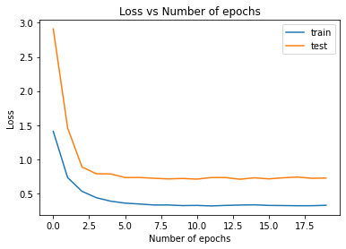
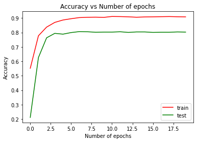

# PointNet

An implementation of [PointNet: Deep Learning on Point Sets for 3D Classification and Segmentation](https://arxiv.org/pdf/1612.00593.pdf) in PyTorch.

## Dataset Used

[ModelNet10](http://3dvision.princeton.edu/projects/2014/3DShapeNets/ModelNet10.zip), this ZIP file contains CAD models from the 10 categories used to train the deep network.
[ModelNet40](http://modelnet.cs.princeton.edu/ModelNet40.zip),this ZIP file contains CAD models from the 40 categories used to train the deep network.

### Modifications to the dataset

Instead of using the original data, that consisted of an pointclouds with an inconsistent amount of vertices, I sampled 1024 points from each of the pointclouds to provide for uniformity during training. The creation of the new data was done using `CreateModelNet` in `dataset.py`, and can be applied for both datasets. The sampled data can be found [here](https://drive.google.com/drive/folders/1kR6dTMev_w5xoWK_rcFlHzXigojUssUF?usp=sharing).

## Training the model
The procedure was the same as mentioned in the paper, including the hyperparameters used. Visualizations of training and testing losses and accuracies can be done using TensorBoard as implemented in `train.ipynb`.

## Results

### ModelNet10

- Training Accuracy : **90.83%**  
- Testing Accuracy : **80.29%**  

Since the model used was originally meant for ModelNet40, it inevitably overfits the training data as can be observed from the plots above.  Pre-trained model available [here](linktomodel)

## File Descriptions

- `model.py` - Model Architecture for the PointNet model
- `loss.py` - Custom loss function specific for the PointNet training process
- `dataset.py` - Custom dataset for ModelNet10
- `train.ipynb` - Training script

## Dependencies
- PyTorch 1.4.0
- Python 3.7.6
- TensorBoard 2.2
